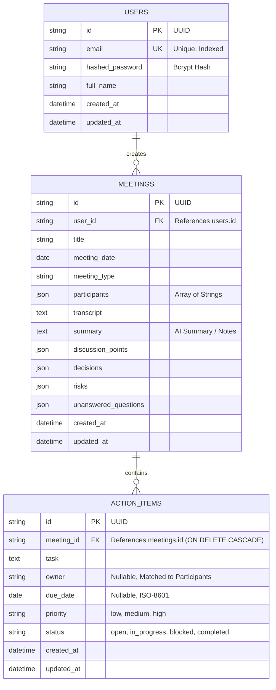

# AI Meeting Notes & Action Tracker

An AI-native full-stack application built to capture post-meeting transcripts, extract structured meeting summaries, discussion points, key decisions, action items, risks, and open questions, and manage deliverables through an interactive Central Action Tracker and real-time operational dashboard.

Built for the **Zignuts AI-Native Campus Hiring Challenge**.

---

## 🚀 Problem Statement

Modern remote and hybrid teams conduct multiple meetings daily, but key decisions and deliverables frequently get lost in long conversation transcripts or unorganized notes. Manual note-taking is slow, error-prone, and distracts participants from active engagement. 

**AI Meeting Notes & Action Tracker** solves this by providing:
1. **Instant Post-Meeting Ingestion**: Accepts transcripts via direct text paste or plain-text (`.txt`) file drag-and-drop.
2. **Grounded AI Synthesis**: Extracts executive summaries, key decisions, discussion points, risks/blockers, unanswered questions, and concrete deliverables without hallucinations.
3. **Interactive Deliverables Management**: Allows team members to edit tasks, update priorities (`low`, `medium`, `high`), reassign owners, and transition statuses (`open`, `in_progress`, `blocked`, `completed`).
4. **Central Action Tracker**: Consolidates all deliverables across all meetings into a single filterable, searchable global view with automated overdue tracking.
5. **Real-Time Operational Dashboard**: Displays high-level team metrics and recent meeting activities.

---

## 🛠️ Technology Stack

| Layer | Technologies |
| :--- | :--- |
| **Frontend** | React 19, Vite 8, JavaScript, React Router v7, Tailwind CSS v4, Lucide React, TipTap Rich Text Editor |
| **Backend** | Python 3.14, FastAPI 0.115, SQLAlchemy 2.0, Pydantic v2, Uvicorn, Bcrypt, PyJWT |
| **Database** | SQLite (with foreign key enforcement and WAL mode) |
| **AI Engine** | Abstracted AI Service Boundary (`MockAIService` with strict heuristic anti-hallucination rules + optional live `GeminiAIService`) |

---

## 📐 Architecture

```text
React (Vite + Tailwind CSS + TipTap)
       │
       │ HTTP/REST (JSON + Cookies)
       ▼
FastAPI Server (Port 8000)
       ├── Authentication (JWT in HttpOnly Cookies, Bcrypt)
       ├── Meetings API (CRUD, Search, Type Filtering)
       ├── Transcripts API (Paste & .txt File Ingestion with Validation)
       ├── Action Items API (CRUD, Central Filtering, Overdue Detection)
       ├── Dashboard API (Aggregated KPIs, Recent Meetings)
       ├── AI Service Boundary (Pydantic-validated Structured Extraction)
       │         ├── MockAIService (Deterministic, Heuristic, Zero-Token)
       │         └── GeminiAIService (Google Gemini 1.5 Flash API)
       └── Database Engine (SQLAlchemy 2.0)
                 │
                 ▼
            SQLite (meetings.db)
```

---

## 📂 Project Structure

```text
MEETINGS/
├── backend/
│   ├── app/
│   │   ├── api/              # API Route Handlers (auth, meetings, actions, dashboard)
│   │   ├── core/             # Config, Database engine, Security utilities
│   │   ├── models/           # SQLAlchemy ORM Models (User, Meeting, ActionItem)
│   │   ├── schemas/          # Pydantic Schemas for Requests, Responses, and AI outputs
│   │   ├── services/         # Abstracted AI Service (Mock & Gemini)
│   │   └── main.py           # Application Entrypoint with CORS, Lifespan, and Exception Handlers
│   ├── tests/                # Automated Pytest Suite (Unit, Integration, and Live E2E)
│   │   ├── conftest.py
│   │   ├── test_auth.py
│   │   ├── test_meetings.py
│   │   ├── test_actions.py
│   │   ├── test_ai.py
│   │   ├── test_dashboard.py
│   │   └── test_live_e2e.py
│   ├── requirements.txt      # Backend Python dependencies
│   └── .env.example          # Backend environment variables
├── frontend/
│   ├── src/
│   │   ├── components/       # Sidebar, RichTextEditor, ActionItemModal, ConfirmModal, EmptyState
│   │   ├── context/          # AuthContext (sessions), ThemeContext (light/dark mode)
│   │   ├── pages/            # LoginPage, RegisterPage, DashboardPage, MeetingsPage, MeetingNewPage, MeetingDetailPage, ActionTrackerPage
│   │   ├── services/         # API Client with Cookie Credentials
│   │   ├── App.jsx           # Routes and ProtectedRoute Wrappers
│   │   ├── index.css         # Tailwind v4 configuration & TipTap typography
│   │   └── main.jsx          # React DOM entrypoint
│   ├── package.json          # Frontend dependencies
│   └── vite.config.js        # Vite build & API proxy setup
├── tasks/
│   ├── spec.md               # Functional & Technical Specification
│   ├── plan.md               # Phased Implementation Plan
│   └── todo.md               # Step-by-Step Task Checklist
├── README.md                 # Complete Project Documentation
├── AI_USAGE.md               # Truthful AI Development & Disclosure Report
├── AGENTS.md                 # Developer & Agent Guidelines
└── .env.example              # Root Environment Template
```

---

## 🗄️ Database Design



---

## 🔌 API Overview

| Method | Endpoint | Description |
| :--- | :--- | :--- |
| `POST` | `/api/auth/register` | Register new user account & set HTTP-only session cookie |
| `POST` | `/api/auth/login` | Authenticate user & set HTTP-only session cookie |
| `POST` | `/api/auth/logout` | Invalidate session & clear cookie |
| `GET` | `/api/auth/me` | Retrieve profile of currently authenticated user |
| `GET` | `/api/meetings` | List meetings with title/transcript search and type filters |
| `POST` | `/api/meetings` | Create new meeting with metadata and transcript |
| `GET` | `/api/meetings/{id}` | Retrieve meeting details, transcript, synthesis, and action items |
| `PUT` | `/api/meetings/{id}` | Update meeting metadata or editable notes/summary |
| `DELETE`| `/api/meetings/{id}` | Delete meeting and cascade delete all its action items |
| `POST` | `/api/meetings/{id}/transcript` | Ingest transcript via text or `.txt` file upload (max 2MB, UTF-8) |
| `POST` | `/api/meetings/{id}/process-ai` | Run AI analysis on transcript, save notes, and extract action items |
| `GET` | `/api/meetings/{id}/actions` | Retrieve action items belonging to a specific meeting |
| `GET` | `/api/actions` | Global query across all action items (filters: status, priority, owner, overdue) |
| `POST` | `/api/actions` | Manually create an action item for a meeting |
| `PUT` | `/api/actions/{id}` | Update action item task, owner, due date, priority, or status |
| `DELETE`| `/api/actions/{id}` | Delete an action item |
| `GET` | `/api/dashboard/stats` | Aggregated metrics: total meetings, total actions, open, completed, overdue |

---

## 🔒 Security Hardening

- **Multi-Tenant Row-Level Authorization**: Every meeting and action item endpoint enforces strict ownership (`meeting.user_id == current_user.id`). User A cannot access or mutate User B's resources (IDOR protection).
- **Session Protection**: JWTs are stored in `HttpOnly`, `SameSite=Lax` cookies, preventing malicious client JavaScript from accessing session tokens (XSS protection).
- **Password Security**: Passwords hashed with `bcrypt` (12 rounds).
- **Upload Sanitization**: Uploads are restricted strictly to plain text `.txt` files with a 2MB maximum size cap and strict UTF-8 decoding checks.
- **Error Masking**: A global exception handler prevents internal database errors or server tracebacks from leaking to clients.

---

## 🤖 AI Guardrails & Anti-Hallucination Policy

The application enforces strict prompt and heuristic guardrails:
1. **Strict Transcript Grounding**: Insights are only extracted from statements explicitly in the transcript.
2. **Assignee Mapping**: Action item owners must correspond to known attendees in the meeting's `participants` list. If unassigned or unclear, `owner` is set to `null` rather than fabricating an identity.
3. **Date Resolution**: Relative dates (e.g., "tomorrow", "Friday") are anchored to the meeting date; unspecified deadlines default to `null`.
4. **Empty Decisions**: If no consensus or decision was reached during the meeting, `decisions` returns an empty array `[]`.

---

## ⚙️ Setup & Running Locally

### Prerequisites
- Python 3.10+ (tested with Python 3.14)
- Node.js 18+ (tested with Node.js v26.5)
- npm 9+

### 1. Clone & Setup Backend
```bash
# Navigate to backend directory
cd backend

# Create virtual environment
python3 -m venv venv
source venv/bin/activate

# Install dependencies
pip install -r requirements.txt

# Run backend server
PYTHONPATH=. uvicorn app.main:app --host 127.0.0.1 --port 8000 --reload
```
The FastAPI backend runs at `http://127.0.0.1:8000`. API documentation is available at `http://127.0.0.1:8000/docs`.

### 2. Setup Frontend
```bash
# Navigate to frontend directory
cd frontend

# Install npm packages
npm install

# Start development server
npm run dev
```
The Vite development server runs at `http://127.0.0.1:5173`. Requests to `/api` are automatically proxied to the backend.

---

## 🧪 Testing

### Automated Backend Tests
Run the comprehensive 20-test pytest suite:
```bash
PYTHONPATH=backend backend/venv/bin/pytest backend/tests -v
```

### Full-Stack Live Integration Test
Verify the complete end-to-end user lifecycle against running servers:
```bash
backend/venv/bin/python backend/tests/test_live_e2e.py
```

### Frontend Bundle Validation
Verify production assets compile cleanly:
```bash
cd frontend && npm run build
```

---

## 💡 Assumptions & Design Decisions
1. **Single-User Workspace per Account**: Teams operate by creating accounts; isolation is maintained per registered user.
2. **Offline-First AI Capability**: To ensure 100% testability and zero external API dependencies, `MockAIService` provides high-fidelity, deterministic extraction adhering to all challenge rules. Setting `GEMINI_API_KEY` in `.env` automatically activates live Google Gemini 1.5 Flash synthesis.
3. **Overdue Calculation**: Overdue status is computed deterministically: `due_date < date.today() AND status != 'completed'`.

---

## 🔮 Future Improvements
1. Speaker Diarization tagging on transcript uploads.
2. Export meeting summaries and deliverables to Markdown or PDF.
3. Batch status updates on the Central Action Tracker.
