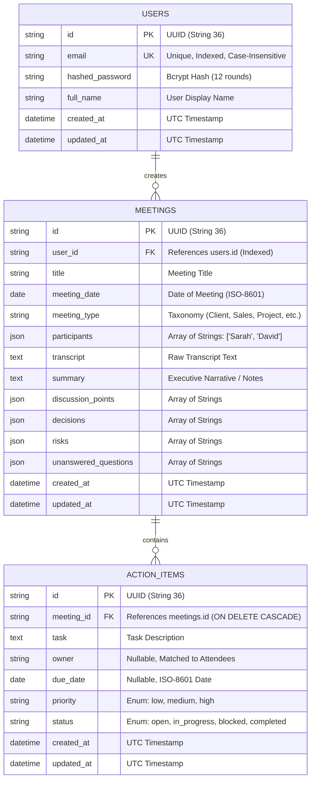

# AI Meeting Notes & Action Tracker

[](https://fastapi.tiangolo.com/)
[](https://react.dev/)
[](https://tailwindcss.com/)
[-003B57?style=flat&logo=sqlite)](https://www.sqlite.org/)
[](https://ai.google.dev/)
[](backend/tests/)

An AI-native full-stack application built to capture post-meeting transcripts, extract structured meeting summaries, discussion points, key decisions, action items, risks, and open questions, and manage deliverables through an interactive Central Action Tracker and real-time operational dashboard.

Built for the **Zignuts AI-Native Campus Hiring Challenge**.

---

## 🚀 Problem Statement & Vision

Modern remote and hybrid teams conduct multiple meetings daily, but key decisions and deliverables frequently get lost in long conversation transcripts or unorganized notes. Manual note-taking is slow, error-prone, and distracts participants from active engagement. 

**AI Meeting Notes & Action Tracker** addresses this challenge with a comprehensive, end-to-end workflow:
1. **Instant Post-Meeting Ingestion**: Accepts transcripts via direct text paste or plain-text (`.txt`) file drag-and-drop.
2. **Grounded AI Synthesis**: Extracts executive summaries, key decisions, discussion points, risks/blockers, unanswered questions, and concrete deliverables with assignees and due dates.
3. **Rich Text Formatting & Human-in-the-Loop Review**: Allows team members to refine summaries with rich text formatting (H1, H2, H3 headings, bold, italic, bullet and numbered lists).
4. **Interactive Deliverables Management**: Enables updating task descriptions, setting priorities (`low`, `medium`, `high`), reassigning owners, and tracking statuses (`open`, `in_progress`, `blocked`, `completed`).
5. **Central Action Tracker**: Consolidates all deliverables across all meetings into a single filterable, searchable global view with automated overdue tracking.
6. **Real-Time Operational Dashboard**: Displays high-level team metrics, completion rates, and recent meeting activities.
7. **One-Click Formatted Copying**: Provides instant clipboard actions across all meeting intelligence categories.

---

## 🛠️ Technology Stack

| Layer | Technologies & Libraries |
| :--- | :--- |
| **Frontend** | React 19, Vite 8, JavaScript (ES modules), React Router v7, Tailwind CSS v4, Lucide React, TipTap Rich Text Editor (`@tiptap/react`, `@tiptap/starter-kit`) |
| **Backend** | Python 3.14 (compatible with 3.10+), FastAPI 0.115, SQLAlchemy 2.0 ORM, Pydantic v2, Uvicorn, Bcrypt, PyJWT, Python-Multipart |
| **Database** | SQLite with WAL mode enabled and strict Foreign Key enforcement (`PRAGMA foreign_keys=ON;`) |
| **AI Engine** | Abstracted Dual-Provider AI Boundary: `MockAIService` (deterministic, heuristic, zero-token) and `GeminiAIService` (Google Gemini 2.5 Flash API via REST) |
| **Testing** | Pytest, AnyIO, Starlette TestClient, Custom Live E2E Integration Suite |

---

## 📐 Architecture & Data Flow

```text
┌────────────────────────────────────────────────────────────────────────┐
│                        React 19 Single Page App                        │
│             (Vite 8 + Tailwind CSS v4 + TipTap Rich Text Editor)        │
└───────────────────────────────────┬────────────────────────────────────┘
                                    │ HTTP/REST (JSON + HttpOnly Cookies)
                                    ▼
┌────────────────────────────────────────────────────────────────────────┐
│                        FastAPI Application Server                      │
│                                (Port 8000)                             │
├───────────────────────────────────┬────────────────────────────────────┤
│ 🔐 Authentication & Session Guard │ JWT in HttpOnly, SameSite=Lax Cookie│
│ 📋 Meeting Management Service     │ CRUD, Full-Text Search, Type Filter│
│ 📥 Transcript Ingestion Service   │ UTF-8 Validation, 2MB Size Guard   │
│ ⚡ Central Action Item Service    │ Cross-Meeting Search & Filter Engine│
│ 📊 Operational Dashboard Engine   │ Real-time KPIs & Aggregations      │
│ 🛡️ Multi-Tenant Security Layer    │ Row-Level Tenant Isolation (IDOR)  │
└─────────────────┬─────────────────┴──────────────────┬─────────────────┘
                  │                                    │
                  ▼                                    ▼
┌───────────────────────────────────┐  ┌───────────────────────────────────┐
│     SQLAlchemy 2.0 ORM Layer      │  │        AI Service Boundary        │
├───────────────────────────────────┤  ├───────────────────────────────────┤
│ Users, Meetings, ActionItems      │  │ 1. MockAIService (Offline Heuristic)│
│ Cascade Deletes & Indexes         │  │ 2. GeminiAIService (Gemini 2.5 Flash│
└─────────────────┬─────────────────┘  └───────────────────────────────────┘
                  │
                  ▼
┌───────────────────────────────────┐
│        SQLite Database (WAL)      │
│            meetings.db            │
└───────────────────────────────────┘
```

---

## ✨ Core Features & Capabilities

### 1. Meeting Management & Multi-Type Support
- Complete metadata tracking: **Title**, **Meeting Date**, **Meeting Type**, **Participants** (comma-separated or list), **Transcript**, **Created Date**, and **Updated Date**.
- Standardized meeting taxonomy:
  - `Client Meeting`
  - `Sales Meeting`
  - `Project Meeting`
  - `Internal Meeting`
  - `Requirement Discussion`
  - `Retrospective`
  - `Other`
- Real-time search by title or transcript content, with filter by meeting type.

### 2. Dual-Mode Transcript Ingestion
- **Direct Text Input**: Paste raw transcripts directly into the transcript viewer or creation modal.
- **File Upload**: Drag-and-drop or select plain-text (`.txt`) files.
- **Validation Guardrails**: Enforces a 2MB maximum file limit, restricts uploads strictly to `.txt` MIME types, and verifies UTF-8 character encoding.

### 3. Grounded AI Synthesis (6 Intelligence Categories)
- Powered by an abstracted service boundary that dynamically toggles between offline heuristic synthesis and live Google Gemini 2.5 Flash processing:
  1. **Executive Summary**: Comprehensive, cohesive overview of meeting context and outcomes.
  2. **Key Decisions**: Explicit consensus points and technical/business choices agreed upon by attendees.
  3. **Discussion Points**: Key topics, arguments, and architectural considerations explored.
  4. **Action Items**: Concrete deliverables with assigned owners (matched to participant list) and due dates.
  5. **Risks & Concerns**: Potential blockers, architectural hurdles, dependencies, or delivery risks.
  6. **Unanswered Questions**: Unresolved topics and follow-up items tabled for subsequent sessions.
- **Copy to Clipboard**: Every single tab includes a dedicated copy action (e.g., "Copy Summary", "Copy Decisions", "Copy Points", "Copy Risks", "Copy Questions") with visual confirmation feedback.

### 4. Rich Text Notes Editor
- Built on TipTap (`@tiptap/react` and `@tiptap/starter-kit`).
- Full formatting toolbar:
  - **Headings**: H1 (`#`), H2 (`##`), H3 (`###`)
  - **Styles**: Bold (`Ctrl+B` / `Cmd+B`), Italic (`Ctrl+I` / `Cmd+I`)
  - **Lists**: Bulleted lists and numbered lists
  - **Controls**: Clear formatting, Undo, and Redo
- Fully responsive typography styled for both Light and Dark modes.

### 5. Central Action Tracker
- Unified view consolidating all action items across all meetings in the user's workspace.
- **Dynamic Search**: Filter by task description, assignee name, or parent meeting title.
- **Faceted Filters**:
  - Filter by **Status**: `open`, `in_progress`, `blocked`, `completed`
  - Filter by **Priority**: `low`, `medium`, `high`
  - Filter by **Owner** (assignee)
  - Filter by **Overdue** items
- **Inline Editing & Quick Toggles**: Update status or priority directly in the table with immediate persistence.
- **Deterministic Overdue Calculation**: Evaluated dynamically (`due_date < today AND status != 'completed'`).

### 6. Operational Dashboard
- Live aggregate statistics:
  - Total Meetings Created
  - Total Action Items Tracked
  - Open Deliverables
  - Completed Deliverables
  - Overdue Action Items
  - Global Completion Percentage
- Recent meetings list with direct jump links and meeting type badges.

### 7. Responsive Design & Dark/Light Theme Engine
- Seamlessly adapts across **Desktop**, **Tablet**, and **Mobile** screen sizes with touch-friendly navigation drawers and responsive tables.
- Class-based Light / Dark theme engine persisted in `localStorage` with zero theme-flicker on initial page load.

---

## 🗄️ Database Design



---

## 🔌 REST API Specification

All protected endpoints require an authenticated session via the `access_token` HTTP-only cookie.

| Method | Endpoint | Request Body / Params | Description |
| :--- | :--- | :--- | :--- |
| `POST` | `/api/auth/register` | `{ email, password, full_name }` | Register new user account & set session cookie |
| `POST` | `/api/auth/login` | `{ email, password }` | Authenticate user & set session cookie |
| `POST` | `/api/auth/logout` | None | Clear session cookie & terminate session |
| `GET` | `/api/auth/me` | None | Retrieve authenticated user profile |
| `GET` | `/api/meetings` | `?search=&meeting_type=&skip=0&limit=50` | List meetings scoped to user with action counts |
| `POST` | `/api/meetings` | `{ title, meeting_date, meeting_type, participants, transcript }` | Create new meeting |
| `GET` | `/api/meetings/{id}` | None | Retrieve meeting details, transcript, synthesis, and action items |
| `PUT` | `/api/meetings/{id}` | `{ title, meeting_date, meeting_type, participants, transcript, summary, ... }` | Update meeting metadata or editable notes |
| `DELETE` | `/api/meetings/{id}` | None | Delete meeting and cascade delete all its action items |
| `POST` | `/api/meetings/{id}/transcript` | Multipart File (`.txt`) OR JSON `{ transcript }` | Upload or update transcript with validation |
| `POST` | `/api/meetings/{id}/process-ai` | None | Trigger AI analysis on transcript, saving notes and extracting action items |
| `GET` | `/api/meetings/{id}/actions` | None | Retrieve action items belonging to a specific meeting |
| `GET` | `/api/actions` | `?search=&status=&priority=&owner=&meeting_id=&is_overdue=` | Global query across all action items with multi-faceted filtering |
| `POST` | `/api/actions` | `{ meeting_id, task, owner, due_date, priority, status }` | Manually create an action item for a meeting |
| `PUT` | `/api/actions/{id}` | `{ task, owner, due_date, priority, status }` | Update action item fields, owner, priority, or status |
| `DELETE` | `/api/actions/{id}` | None | Delete an action item |
| `GET` | `/api/dashboard/stats` | None | Fetch real-time operational dashboard KPIs and recent meetings |

---

## 🔒 Security Hardening & Isolation

1. **Row-Level Tenant Isolation**:
   - Every meeting and action item query is strictly filtered by the authenticated user's ID (`meeting.user_id == current_user.id`).
   - Action item mutations verify ownership of the parent meeting before modifying or deleting records, preventing Insecure Direct Object References (IDOR).
2. **Session Security (XSS Defense)**:
   - JWT tokens are signed using `HS256` and transmitted exclusively in `HttpOnly`, `SameSite=Lax` cookies.
   - Tokens cannot be accessed, read, or exfiltrated via JavaScript `document.cookie` or `localStorage`.
3. **Password Security**:
   - User passwords are automatically salted and hashed using `bcrypt` (12 rounds) before persistence. Plaintext passwords are never logged or stored.
4. **Input & File Upload Protection**:
   - File uploads are strictly restricted to `.txt` plain-text files.
   - Files are capped at 2MB to prevent denial-of-service via large payloads.
   - Uploaded bytes are strictly decoded as UTF-8; invalid or binary content is rejected with HTTP 400.
5. **Error Masking & Stack Trace Protection**:
   - A global FastAPI exception handler intercepts unhandled exceptions, logs the details securely on the server, and returns a sanitized JSON error payload to the client.

---

## 🤖 AI Guardrails & Anti-Hallucination Policy

The application enforces strict prompt and heuristic guardrails:
1. **Strict Transcript Grounding**: Insights are only extracted from statements explicitly present in the transcript.
2. **Assignee Mapping**: Action item owners must correspond to known attendees in the meeting's `participants` list. If unassigned or ambiguous, `owner` is set to `null` rather than fabricating an identity.
3. **Date Resolution**: Relative dates (e.g., "tomorrow", "Friday", "next week") are anchored to the meeting date; unspecified deadlines default to `null`.
4. **Empty Decisions**: If no consensus or decision was reached during the meeting, `decisions` returns an empty array `[]`.
5. **Idempotency**: Re-running AI analysis (`/api/meetings/{id}/process-ai`) updates existing synthesis fields and replaces action items cleanly without creating duplicate or orphaned records.
6. **Graceful Fallback**: If an external LLM call encounters a network timeout or rate limit, the system falls back safely without leaking API keys.

---

## ⚙️ Quick Start & Local Setup

### Prerequisites
- **Python 3.10+** (tested on Python 3.14)
- **Node.js 18+** (tested on Node.js v20+)
- **npm 9+**

---

### Step 1: Backend Setup

```bash
# 1. Navigate to the backend directory
cd backend

# 2. Create and activate a Python virtual environment
python3 -m venv venv
source venv/bin/activate

# 3. Install required Python packages
pip install -r requirements.txt

# 4. (Optional) Configure environment variables
# Copy template:
cp .env.example .env
# Set GEMINI_API_KEY in .env if live Gemini 2.5 Flash synthesis is desired:
# GEMINI_API_KEY=your_gemini_api_key_here
```

---

### Step 2: Seed Demo Data (Optional but Recommended)

To quickly explore the application with pre-populated meetings, rich transcripts, extracted AI insights, and action items:

```bash
# Run the database seeder from the project root
python backend/seed_demo_data.py
```

**Demo Account Credentials:**
- **Email**: `demo@example.com`
- **Password**: `Password123!`

---

### Step 3: Launch Servers

#### Option A: Start Backend
```bash
# Inside backend/ with virtualenv active:
PYTHONPATH=. uvicorn app.main:app --host 127.0.0.1 --port 8000 --reload
```
The FastAPI backend will start at `http://127.0.0.1:8000`. Interactive Swagger API docs are accessible at `http://127.0.0.1:8000/docs`.

#### Option B: Start Frontend
```bash
# In a separate terminal, navigate to frontend/
cd frontend

# Install dependencies
npm install

# Start Vite development server
npm run dev
```
The frontend application will start at `http://127.0.0.1:5173`. Requests to `/api` are automatically proxied to the backend at port 8000.

---

## 🧪 Testing & Verification

### 1. Automated Backend Test Suite (Pytest)
Run the 21-test automated suite covering authentication, meetings CRUD, transcript validation, AI synthesis, action items, overdue calculations, and dashboard metrics:

```bash
PYTHONPATH=backend backend/venv/bin/pytest backend/tests -v
```

**Results:**
```text
backend/tests/test_actions.py::test_action_item_lifecycle PASSED
backend/tests/test_actions.py::test_overdue_logic PASSED
backend/tests/test_actions.py::test_cascade_delete PASSED
backend/tests/test_actions.py::test_action_ownership_isolation PASSED
backend/tests/test_ai.py::test_ai_processing_endpoint PASSED
backend/tests/test_ai.py::test_ai_missing_transcript_error PASSED
backend/tests/test_ai.py::test_mock_ai_anti_hallucination_rules PASSED
backend/tests/test_auth.py::test_register_success PASSED
backend/tests/test_auth.py::test_register_duplicate_email PASSED
backend/tests/test_auth.py::test_login_success PASSED
backend/tests/test_auth.py::test_login_invalid_credentials PASSED
backend/tests/test_auth.py::test_get_me_authenticated PASSED
backend/tests/test_auth.py::test_get_me_unauthenticated PASSED
backend/tests/test_auth.py::test_logout PASSED
backend/tests/test_dashboard.py::test_dashboard_stats PASSED
backend/tests/test_live_e2e.py::test_live_full_user_journey PASSED
backend/tests/test_meetings.py::test_create_and_get_meeting PASSED
backend/tests/test_meetings.py::test_meeting_ownership_isolation PASSED
backend/tests/test_meetings.py::test_meeting_search_and_filter PASSED
backend/tests/test_meetings.py::test_transcript_file_upload PASSED
backend/tests/test_meetings.py::test_transcript_file_upload_invalid_extension PASSED
======================= 21 passed in 24.88s =======================
```

### 2. Full-Stack Live End-to-End Test
Verify the complete real-world user lifecycle against live running servers (registration -> session cookie -> meeting creation -> transcript upload -> AI processing -> action item triage -> central action tracker -> logout):

```bash
backend/venv/bin/python backend/tests/test_live_e2e.py
```

### 3. Frontend Production Build Validation
Ensure clean compilation of frontend production assets with zero syntax or bundling errors:

```bash
cd frontend && npm run build
```

---

## 📂 Repository Structure

```text
MEETINGS/
├── backend/
│   ├── app/
│   │   ├── api/              # Route Handlers: auth, meetings, actions, dashboard
│   │   ├── core/             # Config, Database engine, Security & JWT utilities
│   │   ├── models/           # SQLAlchemy ORM Models: User, Meeting, ActionItem
│   │   ├── schemas/          # Pydantic Schemas for Requests, Responses, and AI
│   │   ├── services/         # AI Service Boundary: MockAIService & GeminiAIService
│   │   └── main.py           # Application Entrypoint (CORS, Lifespan, Exceptions)
│   ├── tests/                # Comprehensive Pytest Suite & Live E2E Integration
│   │   ├── conftest.py       # Fixtures for test DB, test client, and authenticated sessions
│   │   ├── test_actions.py   # Action items CRUD, overdue logic, isolation, cascade delete
│   │   ├── test_ai.py        # AI processing endpoint & anti-hallucination guardrails
│   │   ├── test_auth.py      # Registration, login, logout, session verification
│   │   ├── test_dashboard.py # Dashboard statistical aggregations
│   │   ├── test_live_e2e.py  # Live full-stack end-to-end integration test
│   │   └── test_meetings.py  # Meeting CRUD, search, filter, transcript uploads
│   ├── seed_demo_data.py     # Database seeder with realistic sample meetings
│   ├── requirements.txt      # Python dependencies
│   └── .env.example          # Backend environment variable template
├── frontend/
│   ├── src/
│   │   ├── components/       # UI: Sidebar, RichTextEditor, ActionItemModal, ConfirmModal, EmptyState
│   │   ├── context/          # AuthContext (sessions), ThemeContext (light/dark mode)
│   │   ├── pages/            # Views: Login, Register, Dashboard, Meetings, MeetingNew, MeetingDetail, ActionTracker
│   │   ├── services/         # Axios/Fetch API client with credentials
│   │   ├── App.jsx           # Route registry and ProtectedRoute wrappers
│   │   ├── index.css         # Tailwind CSS v4 custom rules & TipTap prose styles
│   │   └── main.jsx          # React DOM entrypoint
│   ├── package.json          # Frontend dependencies
│   └── vite.config.js        # Vite bundler configuration & backend API proxy
├── tasks/
│   ├── spec.md               # Product and Technical Specification
│   ├── plan.md               # Phased Implementation Plan
│   └── todo.md               # Step-by-Step Task Checklist
├── README.md                 # Complete Project Documentation
├── AI_USAGE.md               # Truthful AI Development & Disclosure Report
├── AGENTS.md                 # Developer & Agent Architectural Guidelines
└── .env.example              # Root Environment Template
```

---

## 📄 Accompanying Reports & Documentation

- **[AI Usage Report (`AI_USAGE.md`)](AI_USAGE.md)**: Detailed disclosure of AI engineering methodology, prompt strategies, discovered bugs, manual corrections, architectural trade-offs, and verification logs.
- **[Agent Manual (`AGENTS.md`)](AGENTS.md)**: Guidelines, security boundaries, and non-goals for autonomous agents and contributing developers.
- **[Technical Specification (`tasks/spec.md`)](tasks/spec.md)**: Complete functional and technical requirements for the Zignuts hiring challenge.
